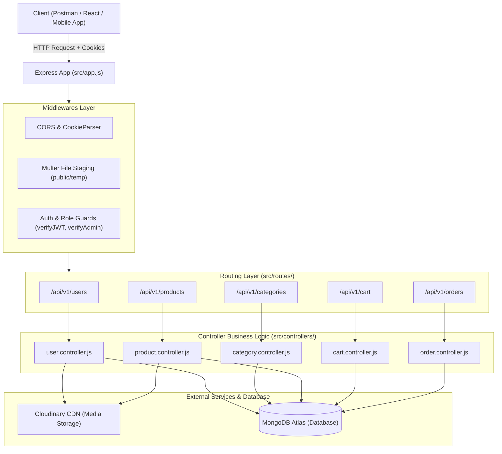

# 🏛️ Complete Production E-Commerce Backend Architecture

---

## 1. High-Level System Architecture Diagram



---

## 2. Request-Response Lifecycle Workflow

```text
1. Client Request
   ├── Sends HTTP Method + Endpoint (e.g., POST /api/v1/products)
   └── Attaches Headers, Body / Form-data, and HTTP-only Cookies (AccessToken)

2. Express App Configuration (src/app.js)
   ├── CORS Middleware: Validates origin whitelist & allows credentials
   ├── JSON & URL-Encoded Parsers: Parses body with 16kb payload limit
   ├── CookieParser: Parses cookies into req.cookies
   └── Static Asset Server: Serves public files

3. Middleware Interceptors (src/middlewares/)
   ├── verifyJWT: Decodes access token, verifies signature, injects req.user
   ├── verifyAdmin: Checks if req.user.role === 'ADMIN' (blocks with 403 Forbidden)
   └── Multer: Captures multipart/form-data images and stages them to public/temp/

4. Routing Layer (src/routes/)
   └── Matches route paths and delegates execution to target controller function

5. Controller Execution (src/controllers/)
   ├── Input Validation: Verifies required fields and data types
   ├── Cloudinary Upload: Uploads local temp images to Cloudinary CDN & unlinks local file
   ├── Mongoose ODM Operations: Queries, updates, or aggregates MongoDB collections
   └── Custom Response: Wraps data in ApiResponse(statusCode, data, message)

6. Database Layer (src/models/)
   ├── Pre-save Hooks: Hashes passwords with Bcrypt before DB write
   ├── Instance Methods: isPasswordCorrect(), generateAccessToken(), generateRefreshToken()
   └── Aggregation Pagination: Performs high-performance paginated queries

7. Error Handling (Global Middleware in src/app.js)
   └── Catches ApiError instances and returns uniform JSON: { statusCode, success: false, message, errors }
```

---

## 3. Core Architectural Modules

### 🔐 1. Authentication & Security Pipeline
- **Dual-Token Architecture**:
  - `accessToken` (`1d` expiry): Stateless authorization sent in cookies/headers.
  - `refreshToken` (`10d` expiry): Stored securely in MongoDB (`user.refreshToken`) for session revocation and renewal.
- **Password Protection**:
  - Hashed using **Bcrypt** with salt round factor of 10 inside the Mongoose `pre("save")` hook.
- **RBAC (Role-Based Access Control)**:
  - Users are assigned roles (`"USER"` vs `"ADMIN"`).
  - Administrative routes are guarded with `verifyAdmin` middleware.

### 📸 2. Media Upload & CDN Strategy
- **Two-Step Upload Pipeline**:
  1. **Multer Disk Storage**: Intercepts `multipart/form-data` and stages files temporarily to `public/temp/`.
  2. **Cloudinary Uploader**: Uploads files from `public/temp/` to Cloudinary CDN with automatic resource type detection.
  3. **Local Cleanup**: Synchronously deletes temporary files (`fs.unlinkSync`) whether upload succeeds or fails, guaranteeing zero server disk bloat.
- **MongoDB Optimization**:
  - Only stores lightweight Cloudinary URL strings in the database, avoiding MongoDB document size limits (16MB BSON limit).

### 🏷️ 3. E-Commerce Catalog & Aggregation
- **Category Hierarchy**:
  - Organized product grouping with unique name enforcement.
- **Product Filtering & Pagination**:
  - Full-text search regex across title and description.
  - Category filtering via `$match` and `$lookup` pipeline stages.
  - High-performance aggregation pagination via `mongoose-aggregate-paginate-v2`.

### 🛒 4. Shopping Cart & Inventory Management
- **Cart Lifecycle**:
  - One dedicated shopping cart per user document.
  - Real-time stock verification against `product.stock` before item insertion or quantity increment.
  - Automated calculation of `cartTotal`.

### 📦 5. Order Checkout & Status Lifecycle
- **Atomic Checkout**:
  - Validates stock across all cart items.
  - Captures snapshot pricing (`orderItems.price = product.price`) to prevent historical price discrepancy.
  - Deducts inventory units from `Product.stock`.
  - Empties user's cart upon order confirmation.
- **Order Lifecycle States**:
  - Fulfillment: `PENDING` ➔ `PROCESSING` ➔ `SHIPPED` ➔ `DELIVERED` ➔ `CANCELLED`
  - Payment: `PENDING` ➔ `PAID` ➔ `FAILED`

---

## 4. API Endpoints Specification

### 👤 Users (`/api/v1/users`)
- `POST /register` – Register new user with avatar file upload
- `POST /login` – Authenticate user & issue JWT cookies
- `POST /refresh-token` – Rotate and renew expired access tokens
- `POST /logout` – Invalidate DB refresh token & clear cookies
- `GET /current-user` – Fetch logged-in user profile details
- `POST /change-password` – Update user password
- `PATCH /update-account` – Update user fullName & email
- `PATCH /avatar` – Upload & update avatar image

### 🏷️ Categories (`/api/v1/categories`)
- `GET /` – List all product categories (Public)
- `GET /:categoryId` – Get details of a single category (Public)
- `POST /` – Admin creates new category (`verifyAdmin`)
- `PATCH /:categoryId` – Admin updates category name (`verifyAdmin`)
- `DELETE /:categoryId` – Admin deletes category (`verifyAdmin`)

### 🛒 Products (`/api/v1/products`)
- `GET /` – Paginated product list with search & filter (Public)
- `GET /:productId` – View product details with category info (Public)
- `POST /` – Admin creates product with `mainImage` & `subImages` (`verifyAdmin`)
- `PATCH /:productId` – Admin updates product details (`verifyAdmin`)
- `PATCH /:productId/main-image` – Admin updates product primary image (`verifyAdmin`)
- `DELETE /:productId` – Admin deletes product listing (`verifyAdmin`)

### 🛍️ Shopping Cart (`/api/v1/cart`)
- `GET /` – View shopping cart with auto-calculated total (`verifyJWT`)
- `POST /add` – Add product to cart with inventory check (`verifyJWT`)
- `PATCH /items/:productId` – Update quantity of item in cart (`verifyJWT`)
- `DELETE /items/:productId` – Remove single item from cart (`verifyJWT`)
- `DELETE /` – Clear all items from cart (`verifyJWT`)

### 📦 Orders (`/api/v1/orders`)
- `POST /checkout` – Place order, deduct stock, empty cart (`verifyJWT`)
- `GET /my-orders` – View customer's order history (`verifyJWT`)
- `GET /:orderId` – View single order invoice details (`verifyJWT`)
- `GET /admin/all` – Admin view of all store orders (`verifyAdmin`)
- `PATCH /admin/:orderId` – Admin update delivery / payment status (`verifyAdmin`)

---

<div align="center">
  <sub>Documented for the E-Commerce Backend Series • Maintained by <a href="https://github.com/CRraikar18">Chirag Raikar</a></sub>
</div>
